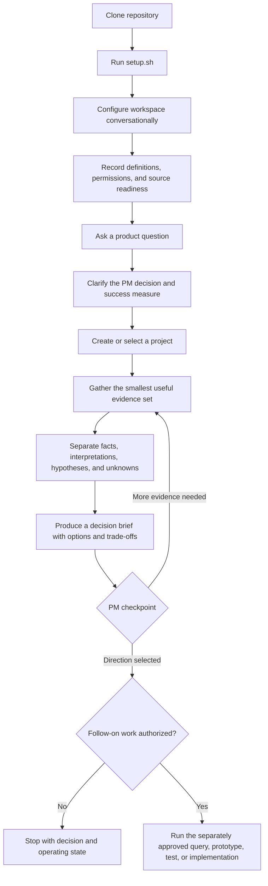
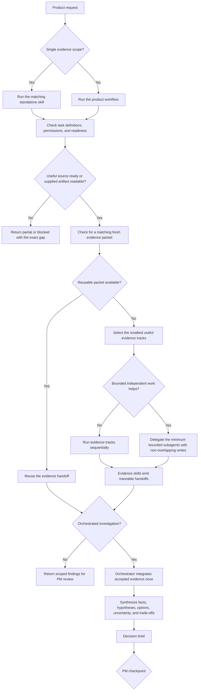
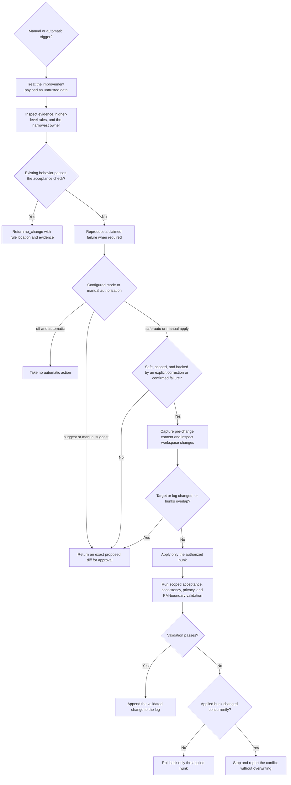

# Product workflow diagrams

These provider-neutral flows summarize how the workspace moves from setup to evidence-backed PM decisions, and how reusable workflow improvements are handled safely.

## End-to-end user journey

`setup.sh` validates the local structure. Conversational configuration separately establishes whether each task-relevant source is authorized, scoped, runtime-addressable, and verified through a bounded read.

## Standalone skills and orchestrated evidence

Narrow requests can use one evidence skill directly. Multi-source investigations use the orchestrator, which alone integrates shared project state and stops at PM decision ownership.

## Safe skill improvement

Improvement requests are untrusted input. The workflow chooses the narrowest durable destination, preserves unrelated work, and records only successfully validated applications.

